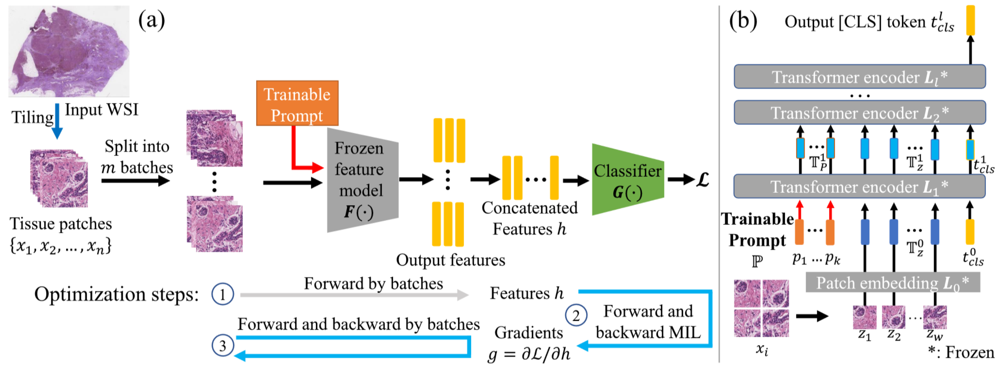

# Prompt-MIL: Boosting Multi-Instance Learning Schemes via Task-specific Prompt Tuning
Pytorch implementation for the prompt tuning framework for MIL schemes described in the paper [Prompt-MIL: Boosting Multi-Instance Learning Schemes via Task-specific Prompt Tuning](empty), [arxiv](https://arxiv.org/abs/2303.12214) and [video](https://youtu.be/nLoeoILkh7k) (_MICCAI 2023, accepted for oral presentation_).  

<div>
  
</div>

## Installation
Install [Anaconda/miniconda](https://www.anaconda.com/products/distribution).  
Required packages:
```
  $ conda create --name promptmil anaconda
  $ conda activate promptmil
  $ conda install pytorch torchvision torchaudio pytorch-cuda=11.8 -c pytorch -c nvidia
  $ pip install opencv-contrib-python kornia pytorch-lightning=2.0.2 torchmetrics=0.11.4 albumentations tqdm pandas wandb timm
``` 
You can also use docker or singularity. We provide the [Dockerfile](Dockerfile) we used in our experiments.
If you do not want to use wandb, you can change the logger in [main.py](main.py).

## Data organization
Our dataset is organized as csv indicated datasets. All the images should be stored in a single directory and the path of this directory (```dataset_root```) should be passed to ```main.py```. The labels and train/validation/test separation should be listed in a csv file. This csv file should contain 4 columns: ```wsi_id```, ```label```, ```len_img``` and ```fold```. The [csv files](dataset_csv) are provided. 

* ```slide_id``` is the filename of input image, not including file extension. 
* ```label``` is the integer label of an input WSI. 
* ```len_img``` represents the number of patches that this WSI contains. To reduce the time of dataloading thousands of patches, we merge every 200 patches vertically into a single patch (in [merge_img_wsi.py](script/merge_img_wsi.py)). Each image should have the filename ```slide_id_%d.jpg```, where %d is the index 0,1,2,...
* ```fold``` represents "train" (fold > 0), "valid" (fold = 0) or "test" (fold < 0). 


## Training
We used ```main.py``` to train and evaluate our framework. 
```
usage: main.py [-h] [--output-dir OUTPUT_DIR] [--val_fold VAL_FOLD] [--batch-size-train BATCH_SIZE_TRAIN] [--batch-size-eval BATCH_SIZE_EVAL] [--dataset-name DATASET_NAME]
               [--data-norm] [--data-mean DATA_MEAN] [--data-std DATA_STD] [--num-workers NUM_WORKERS] [--model MODEL] [--transfer-type TRANSFER_TYPE] [--network NETWORK]
               [--num-prompt-tokens NUM_PROMPT_TOKENS] [--deep-prompt] [--prompt-dropout PROMPT_DROPOUT] [--project-prompt-dim PROJECT_PROMPT_DIM] [--epochs EPOCHS]
               [--precision PRECISION] [--weight-decay WEIGHT_DECAY] [--lr LR] [--lr-factor LR_FACTOR] [--adam] [--loss-weight LOSS_WEIGHT] [--auto-loss-weight]
               [--accumulate-grad-batches ACCUMULATE_GRAD_BATCHES] [--dropout-inst DROPOUT_INST] [--dropout-att DROPOUT_ATT] [--pretrained]
               [--load-backbone-weight LOAD_BACKBONE_WEIGHT] [--load-weights LOAD_WEIGHTS] [--gpu-id GPU_ID] [--run-name RUN_NAME] [--tag TAG] [--clam-size CLAM_SIZE]
               dataset_root dataset_csv
```
Useful arguments:
```
dataset_root           # Path to all the patches in the dataset
dataset_csv            # Path to the dataset csv file
--output-dir           # Path of directory to store outputs
[--dataset-name]       # Name of the dataset [tcga-brca|tcga-crc-cings|bright-3]
[--model]              # Type of MIL schemes [dsmil|dsmil_ce|clam_sb|clam_mb|abmil|gabmil]
[--network]            # Type of backbone network, e.g. dion_vit_tiny_patch16_192

[--transfer-type]      # Type of fine-tuning, [prompt|end2end]
[--num-prompt-tokens]  # Number of prompt tokens to add

[--num_epochs]         # Number of training epochs
[--lr]                 # Initial learning rate
[--weight-decay]       # Weight decay of the optimizer
[--batch-size-train]   # The patch level batch size in training as shown in Figure 1(a) 
[--batch-size-eval]    # The patch level batch size in evaluation.

[--load-backbone-weight] # Path to the pretrained weights
[--run-name]           # Project name
[--tag]                # Experiment tag 
[--gpu-id]             # The id of one or multiple gpus to use, eg "0" or "0,1,2,3"

```
Note that the slide level batch size is always 1 as the input slide usually have different number of patches. We accumulate gradient of several batches by setting ```--accumulate-grad-batches```, it is equivalent to a larger batch size.

The entire training can be done by, for example:

```
$ python main.py /path/to/merged/images dataset_csv/tcga_brca_label_cv.csv --output-dir /path/to/output --dataset-name tcga-brca --model dsmil --network dino_vit_tiny_patch16_192 --transfer-type "prompt" --epochs 50 --batch-size-train 512 --batch-size-eval 1024 --accumulate-grad-batches 8 --num-prompt-tokens 1 --lr 1e-4 --weight-decay 1e-2 --load-backbone-weight /path/to/the/weights/tcga-brca-vitt.pth --run-name PromptMIL --tag tcga_brca_prompt_vitt --gpu-id 0
$ python main.py /path/to/merged/images dataset_csv/bright3_label_cv.csv --output-dir /path/to/output --dataset-name bright-3 --model dsmil_ce --network dino_vit_tiny_patch16_192 --transfer-type "prompt" --epochs 50 --batch-size-train 512 --batch-size-eval 1024 --accumulate-grad-batches 8 --num-prompt-tokens 1 --lr 1e-4 --adam --weight-decay 5e-2 --load-backbone-weight /path/to/the/weights/bright-vitt.pth --run-name PromptMIL --tag bright3_prompt_vitt --gpu-id 1
$ python main.py /path/to/merged/images dataset_csv/tcga_crc_cings_label_cv.csv --output-dir /path/to/output --dataset-name tcga-crc-cings --model dsmil --network dino_vit_tiny_patch16_192 --transfer-type "prompt" --epochs 40 --batch-size-train 256 --batch-size-eval 512 --accumulate-grad-batches 8 --num-prompt-tokens 1 --lr 1e-4 --weight-decay 1e-2 --load-backbone-weight /path/to/the/weights/tcga-crc-vitt-cings.pth  --run-name PromptMIL --tag tcga_crc_cings_prompt_vitt --gpu-id 2
```
Our DINO pretrained weights can be found [here](https://drive.google.com/drive/folders/1lutxjrKIOuZRS0g3iGiLdPxFrR1Rfn7R?usp=sharing).

## Contact
If you have any questions or concerns, feel free to directly contact us at Jingwei Zhang <jingwezhang@cs.stonybrook.edu> or report issues. 

## Acknowledgments
Our framework used [Pytorch Lightning](https://github.com/Lightning-AI/lightning). Thanks for this simple and efficient framework which facilitated our development.
Part of our code was borrowed from [DSMIL](https://github.com/binli123/dsmil-wsi), [CLAM](https://github.com/mahmoodlab/CLAM), [HIPT](https://github.com/mahmoodlab/HIPT), and [TransPath](https://github.com/Xiyue-Wang/TransPath). Thanks for their outstanding work.
## Citation
If you use the code or results in your research, please use the following BibTeX entry.  
```
@inproceedings{zhang2023prompt,
  title={Prompt-MIL: Boosting Multi-Instance Learning Schemes via Task-specific Prompt Tuning},
  author={Zhang, Jingwei and Kapse, Saarthak and Ma, Ke and Prasanna, Prateek and Saltz, Joel and Vakalopoulou, Maria and Samaras, Dimitris},
  booktitle={International Conference on Medical Image Computing and Computer-Assisted Intervention},
  year={2023},
  organization={Springer}
}
```

[comment]: # (python main.py /scratch/KurcGroup/jingwei/gpfs/data/BRIGHT-10x/merged_imgs dataset_csv/bright3_label_cv.csv --output-dir /scratch/KurcGroup/jingwei/Projects/tmp/tmp_out --dataset-name bright-3 --model dsmil_ce --network dino_vit_tiny_patch16_192 --transfer-type "prompt" --epochs 50 --batch-size-train 512 --batch-size-eval 1024 --accumulate-grad-batches 2 --num-prompt-tokens 1 --lr 1e-4 --adam --weight-decay 5e-2 --load-backbone-weight /scratch/KurcGroup/jingwei/gpfs/result/weights/kapse_ICLR/bright-vitt.pth --run-name PromptMIL --tag bright3_prompt_vitt --gpu-id 0,1,2,3)
[comment]: # (python main.py /scratch/KurcGroup/jingwei/gpfs/data/TCGA-BRCA-5x/merged_imgs dataset_csv/tcga_brca_label_cv.csv --output-dir /scratch/KurcGroup/jingwei/Projects/tmp/tmp_out --dataset-name tcga-brca --model dsmil --network dino_vit_tiny_patch16_192 --transfer-type "prompt" --epochs 50 --batch-size-train 512 --batch-size-eval 1024 --accumulate-grad-batches 2 --num-prompt-tokens 1 --lr 1e-4 --weight-decay 1e-2 --load-backbone-weight /scratch/KurcGroup/jingwei/gpfs/result/weights/kapse_ICLR/tcga-brca-vitt.pth --run-name PromptMIL --tag tcga_brca_prompt_vitt --gpu-id 4,5,6,7)
[comment]: # (python main.py /scratch/KurcGroup/jingwei/gpfs/data/TCGA-CRC-10x/merged_imgs dataset_csv/tcga_crc_cings_label_cv.csv --output-dir /scratch/KurcGroup/jingwei/Projects/tmp/tmp_out --dataset-name tcga-crc-cings --model dsmil --network dino_vit_tiny_patch16_192 --transfer-type "prompt" --epochs 40 --batch-size-train 256 --batch-size-eval 512 --accumulate-grad-batches 2 --num-prompt-tokens 1 --lr 1e-4 --weight-decay 1e-2 --load-backbone-weight /scratch/KurcGroup/jingwei/gpfs/result/weights/kapse_ICLR/tcga-crc-vitt-cings.pth  --run-name PromptMIL --tag tcga_crc_cings_prompt_vitt --gpu-id 0,1,2,3)